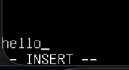
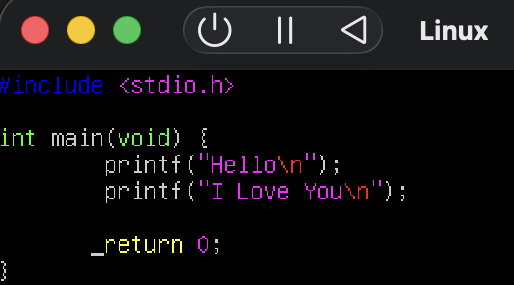
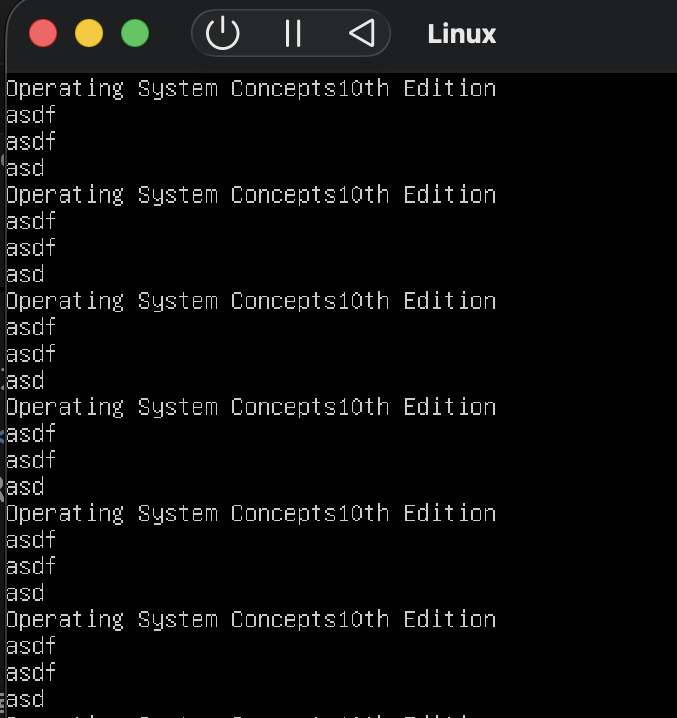
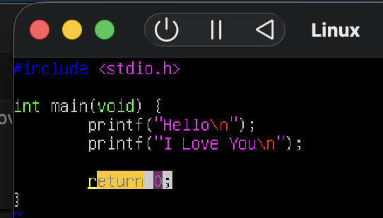

# How to use Vim (in Linux)
  

1. How to create file(vim)?
2. What is Command mode and Input mode?
3. Move Cursor
4. Move Screen
5. UNDO & REDO
6. Delete or Edit
7. Paste(?)
8. Copy
9. Selection
10. Great Tips

   

## 1. How to create file? (Vim)
`$ vim [file [file ...]]`
e.g. `$ vim hello.c`

   

## 2. What is Command mode and Input mode
**Command mode**  
- 디폴트
- 밑에 INSERT가 안 적혀있음. 이 때 저장 or 종료 가능

 

- 종료(저장X) 명령: `:q(!)`
- 저장 명령: `:wq(!)`
- `!` 붙으면 강제

 

**Input mode**
- command mode일 때 i 누르면 `-- INSERT --` 가 뜨는데, 이러면 Input mode 이다
- 이때 코드를 자유롭게 작성할 수 있다
- `ESC` 누르면 command로 돌아감

 

이 글에 나오는 명령어는 기본 command mode라고 보면 된다.. (~~내가 헷갈렸다~~)

   

## 3. Move Cursor
- `w` : 다음 단어 시작 부분으로 점프
- `b` : 이전 단어 시작 부분으로 점프
- `$` : 그 줄의 **맨 끝**으로 이동
- `0` : 그 줄의 **맨 앞**으로 이동

 

command mode에서 '0'을 누르면 그 줄의 맨 앞으로 이동한다

   

## 4. Move Screen
- In command mode
    - `^F` -> 내리기(down)
    - `^B` -> 올리기(up)
    - `^D` -> 반만 내리기
    - `^U` -> 반만 올리기

   

## 5. UNDO & REDO
- UNDO: `u` (~~매우 편하다..~~)
- REDO: `Ctrl` + `r`

   

## 6. Delete or Edit

`ESC`를 눌러 하단의 `-- INSERT --` 가 사라진 상태에서 진행

- `x` : 커서가 위치한 글자 **딱 한 개** 삭제
- `r` + [바꿀 글자]: 현재 글자를 다른 글자로 교체(Replace, Command mode)
    - e.g. t를 p로 바꾸고 싶으면 커서가 있는 자리에서 `rp`
- `D`: 커서 있는 위치부터 문장의 끝까지 삭제
- `dd` : 커서가 있는 **한 줄 전체 삭제**
- `cw` : 현재 단어를 삭제하고 바로 **INSERT(input) mode로 전환**.  
    - e.g. 단어 오타 났을 때 `ESC` -> 단어 앞글자로 이동 -> `cw` -> 새로 입력
- `.` : 방금 한 거 다음줄에 한 번 더(~~복붙의 느낌~~)

   

## 7. Paste
- `p`: 마지막으로 지워진 것을 커서의 뒤에 삽입
- `P`: 마지막으로 지워진 것을(~~잘라낸 거~~) 커서 앞에 삽입

이건 이미지 붙이는 게 빠를 듯

## 8. Copy
- `yy` : 현재 줄 복사
yy 쓰고 나서 p 아니면 P 쓰니까 되는 듯

   

## 9. Selection

- `v` : **문자** 단위로 **블록** 선택
- `V` : **줄** 단위로 **전체 줄** 선택
- `Ctrl + v` : **열** 단위로 **사각형 범위**를 선택한다

 

화면 하단에 'VISUAL'이라고 나온 것을 볼 수 있다.  

첫 번째 사진: 'v' 누르고 방향 키 눌렀을 때  
두 번째 사진: 'Ctrl + v' 누르고 방향 키 눌렀을 때.  

이동 키는 hjkl로도 움직일 수 있는 듯 하다.  
(h left, j down, k up, l right)

   

## 10. Great Tips
- `%` (괄호 짝 찾기) : 괄호 위에 커서를 두고 `%`를 누르면 짝이 맞는 반대편 괄호로 커서가 순간 이동. 괄호가 안 닫혔다면 커서가 움직이지 않는다.
- `==` (자동 들여쓰기 정렬) : 오타 수정하다가 들여쓰기 엉망 됐을 때 해당 줄에서 `==` 를 누르기 (~~그런데 이건 좀 읭?스러움 써보면 앎~~)
    - 코드 전체 정렬: `gg`(맨 위로 이동) -> `v`(비주얼 모드) -> `G`(맨 아래까지 선택) -> `=`(정렬)